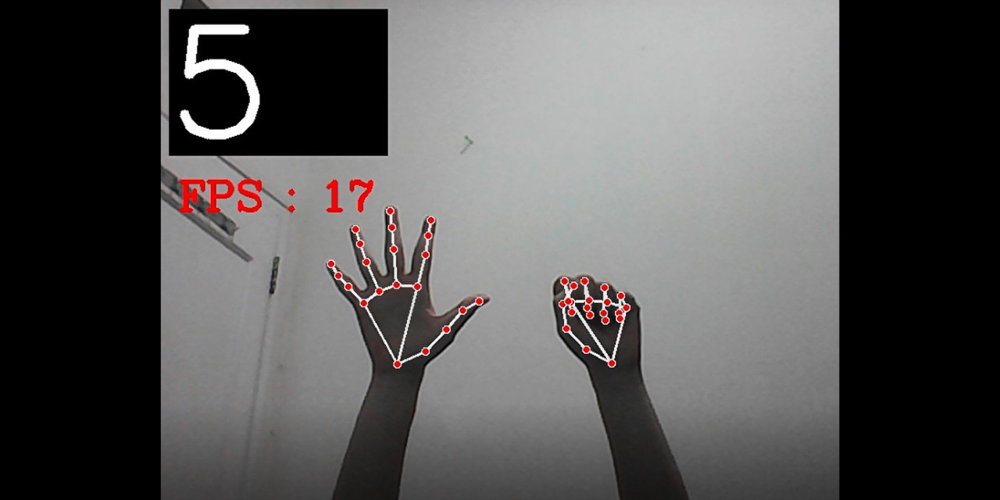

# AI Hand Gesture Recognition (Finger Counter) using Python Programming Language
This is a mid-term project of the Image Processing and Understanding course and I worked it on with one of my friends. In this project, we created an AI Hand Gesture Recognition (Finger Counter) using Python Programming Language with its two libraries such as OpenCV and MediaPipe.  

This project or program was conducted with the aim of helping toddlers or young children to be able to recognize numbers, number gestures on fingers, and how to calculate simple calculations using fingers in an exciting way with the help of visualization. To use this program, the user must be in front of the computer's webcam. The webcam will be used to recognize the shape and pattern of the user's hand and the hand signer will count the number of fingers recorded on the webcam. The program will display the results of hand patterns and the number of fingers that are recognized on a real-time video frame stream.

For the detail on how we make it you may download and read our report that I have already attached within this repository.

